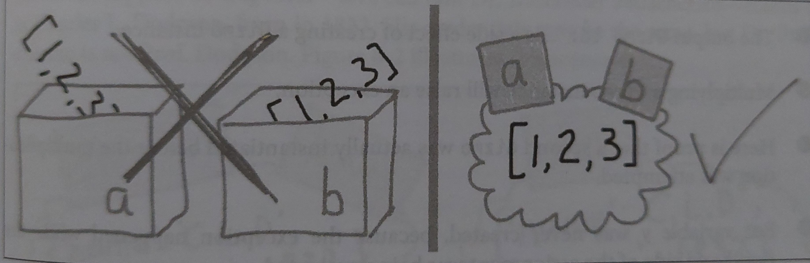

Apie kintamuosius geriau negalvoti kaip apie konteinerius(dėžutes su kintamojo pavadinimu). Tarkime turime sąrašą:

```python
a = [1, 2, 3]
b = a
a.append(4)
print(b)

# [1, 2, 3, 4]

```

Jeigu šiuo atveju galvotumėm apie kintamuosius kaip apie konteinerius, kuriuose yra po sąrašą, susidarytumėm klaidingą įspūdį, kad prilygindami b kintamąjam a sukuriame pastarojo kopiją.

Iš tikrųjų a, kaip ir b refereuoja į tą patį objektą atmintyje.



Todėl geriau apie a ir b galvoti kaip apie lipdukus su kintamojo pavadinimu, priklijuotus prie objekto atmintyje.

Sukūrę b ir prilyginę jį a, tiesiog sukūrėme alternatyvų kintamąjį (alias) referuojantį į tą patį objektą.

Tai nesunku patikrinti:

```python
print(a is b)
print(id(a), id(b))

# True
# 139873474569280 139873474569280
```

Tai galioja _pass by reference_ objektams - pvz list, set, dictionary. Su primityvais ši logika negalioja:

```python
a = 123
b = a
a += 7
print(b)

print(a is b)
print(id(a), id(b))
```

Nežinant šių niuansų, galima prigaminti programų su bug'ais. Kuomet nemetant klaidos programa elgiasi keistai :)

```python
class Wallet:
    def __init__(self, incomes=[]):
        self.incomes = incomes

    def add_income(self, amount):
        self.incomes.append(amount)

    def get_total_income(self):
        return sum(self.incomes)


w1 = Wallet()
w1.add_income(200)
print(w1.get_total_income())


w2 = Wallet()
w2.add_income(300)
print(w2.get_total_income())

class Wallet:
    def __init__(self, incomes=[]):
        self.incomes = incomes

    def add_income(self, amount):
        self.incomes.append(amount)

    def get_total_income(self):
        return sum(self.incomes)


w1 = Wallet()
w1.add_income(200)
print(w1.get_total_income())


w2 = Wallet()
w2.add_income(300)

# 200
# 500
```

Šiuo atveju sukurtos dvi piniginės naudojant numatytąją reikšmę iš parametrų - tuščias listas. Kuomet sukuriama ir papildoma antra piniginė - joje stebuklingai atsiranda keliais šimtais daugiau pinigų. Taip yra todėl, kad:

- sukūrus klasę numatytoji reikšmė (tuščias listas) yra sukuriama atmintyje kaip objektas.
- sukūrus pirmą piniginę su default incomes reikšme, tas objektas atmintyje yra modifikuojamas metodu append.
- kuriant antrą objektą jis pasigauna jau pakoreguotą numatytąją reikšmę.

jeigu tikrai būtina turėti listą kaip numatytą argumentą - sprendimas galėtų būti:

```python
    def __init__(self, incomes=[]):
        self.incomes = list(incomes)
```

kuomet sukuriame listą iš numatyto listo - turime to numatyto listo kopiją.

```python
basketball_team = ['John', 'Peter', 'Colt', 'Mary', 'Rose']


class Train:
    def __init__(self, passengers):
        self.passengers = passengers

    def drop_passenger(self, name):
        self.passengers.remove(name)


t = Train(basketball_team)
t.drop_passenger('Mary')

print(basketball_team)
```

po pasivažinėjimo traukiniu, komandoje nebeliko žaidėjos.

_medžiaga kurta remiantis pavyzdžiais iš knygos Fluent Python. Rekomenduoju įsigyti._
